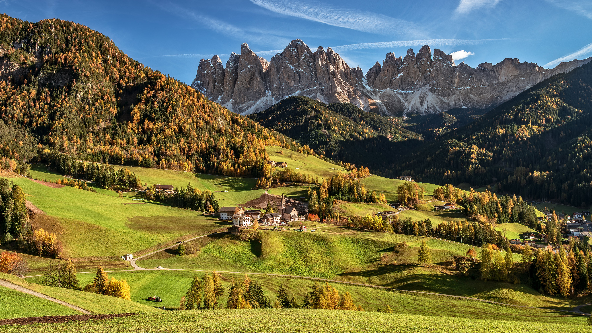

```json
{
  "images": [
    {
      "startdate": "20231110",
      "fullstartdate": "202311101600",
      "enddate": "20231111",
      "url": "/th?id=OHR.ValDiFunes_ZH-CN2080915930_UHD.jpg&rf=LaDigue_UHD.jpg&pid=hp&w=3840&h=2160&rs=1&c=4",
      "urlbase": "/th?id=OHR.ValDiFunes_ZH-CN2080915930",
      "copyright": "富内斯山谷，背景是多洛米蒂山，南蒂罗尔，意大利 (© Achim Thomae/Getty Images)",
      "copyrightlink": "/search?q=%e5%8d%97%e8%92%82%e7%bd%97%e5%b0%94&form=hpcapt&mkt=zh-cn",
      "title": "如诗如画的地方",
      "quiz": "/search?q=Bing+homepage+quiz&filters=WQOskey:%22HPQuiz_20231110_ValDiFunes%22&FORM=HPQUIZ",
      "wp": true,
      "hsh": "58575e41aae9782c7f14819ddf6e4dfd",
      "drk": 1,
      "top": 1,
      "bot": 1,
      "hs": []
    }
  ],
  "tooltips": {
    "loading": "正在加载...",
    "previous": "上一个图像",
    "next": "下一个图像",
    "walle": "此图片不能下载用作壁纸。",
    "walls": "下载今日美图。仅限用作桌面壁纸。"
  }
}
```
