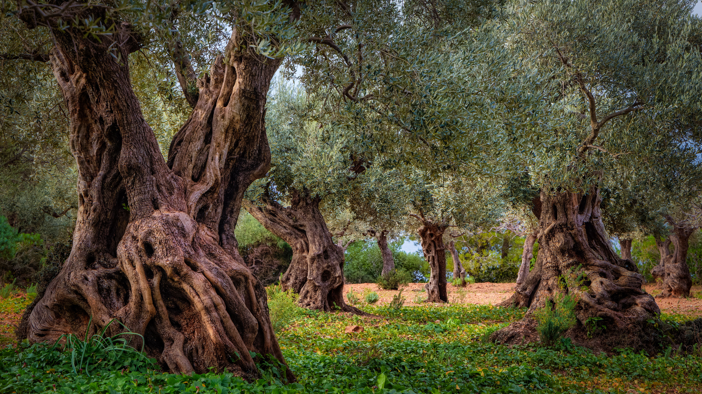

```json
{
  "images": [
    {
      "startdate": "20231112",
      "fullstartdate": "202311121600",
      "enddate": "20231113",
      "url": "/th?id=OHR.OliveOrchard_ZH-CN8198989130_UHD.jpg&rf=LaDigue_UHD.jpg&pid=hp&w=3840&h=2160&rs=1&c=4",
      "urlbase": "/th?id=OHR.OliveOrchard_ZH-CN8198989130",
      "copyright": "特拉蒙塔纳山中的老橄榄园，马略卡岛，西班牙 (© cinoby/Getty Images)",
      "copyrightlink": "/search?q=%e8%a5%bf%e7%8f%ad%e7%89%99%e9%a9%ac%e7%95%a5%e5%8d%a1%e5%b2%9b&form=hpcapt&mkt=zh-cn",
      "title": "从树上到餐桌之上",
      "quiz": "/search?q=Bing+homepage+quiz&filters=WQOskey:%22HPQuiz_20231112_OliveOrchard%22&FORM=HPQUIZ",
      "wp": true,
      "hsh": "9d2e276d36d0b7817a051c62fd3fc0dd",
      "drk": 1,
      "top": 1,
      "bot": 1,
      "hs": []
    }
  ],
  "tooltips": {
    "loading": "正在加载...",
    "previous": "上一个图像",
    "next": "下一个图像",
    "walle": "此图片不能下载用作壁纸。",
    "walls": "下载今日美图。仅限用作桌面壁纸。"
  }
}
```
