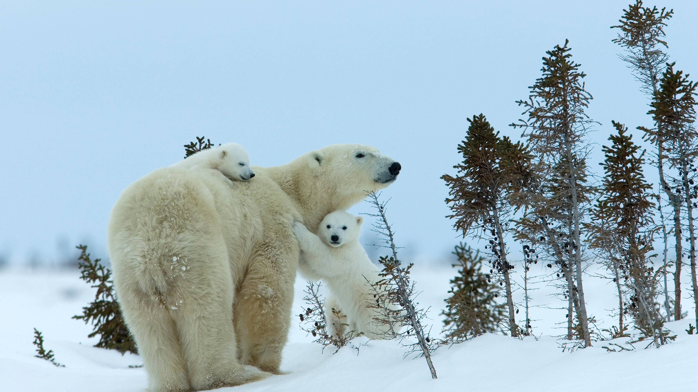

```json
{
  "images": [
    {
      "startdate": "20231117",
      "fullstartdate": "202311171600",
      "enddate": "20231118",
      "url": "/th?id=OHR.MilsePolarBear_ZH-CN0567475122_UHD.jpg&rf=LaDigue_UHD.jpg&pid=hp&w=3840&h=2160&rs=1&c=4",
      "urlbase": "/th?id=OHR.MilsePolarBear_ZH-CN0567475122",
      "copyright": "北极熊妈妈和幼崽，丘吉尔城，曼尼托巴省，加拿大 (© Thorsten Milse/Getty Images)",
      "copyrightlink": "/search?q=%e4%b8%98%e5%90%89%e5%b0%94%e5%9f%8e&form=hpcapt&mkt=zh-cn",
      "title": "寒地温情",
      "quiz": "/search?q=Bing+homepage+quiz&filters=WQOskey:%22HPQuiz_20231117_MilsePolarBear%22&FORM=HPQUIZ",
      "wp": true,
      "hsh": "716469e66ba7e13bac08475fdffefc06",
      "drk": 1,
      "top": 1,
      "bot": 1,
      "hs": []
    }
  ],
  "tooltips": {
    "loading": "正在加载...",
    "previous": "上一个图像",
    "next": "下一个图像",
    "walle": "此图片不能下载用作壁纸。",
    "walls": "下载今日美图。仅限用作桌面壁纸。"
  }
}
```
