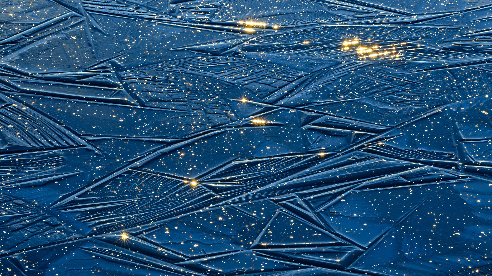

```json
{
  "images": [
    {
      "startdate": "20231118",
      "fullstartdate": "202311181600",
      "enddate": "20231119",
      "url": "/th?id=OHR.FrozenBog_ZH-CN0712859386_UHD.jpg&rf=LaDigue_UHD.jpg&pid=hp&w=3840&h=2160&rs=1&c=4",
      "urlbase": "/th?id=OHR.FrozenBog_ZH-CN0712859386",
      "copyright": "Alam-Pedja自然保护区，爱沙尼亚 (© Sven Zacek/Minden Pictures)",
      "copyrightlink": "/search?q=Alam-Pedja%e8%87%aa%e7%84%b6%e4%bf%9d%e6%8a%a4%e5%8c%ba&form=hpcapt&mkt=zh-cn",
      "title": "谨慎行事！",
      "quiz": "/search?q=Bing+homepage+quiz&filters=WQOskey:%22HPQuiz_20231118_FrozenBog%22&FORM=HPQUIZ",
      "wp": true,
      "hsh": "84f77a21ca7eaa925c00d923894dbbc9",
      "drk": 1,
      "top": 1,
      "bot": 1,
      "hs": []
    }
  ],
  "tooltips": {
    "loading": "正在加载...",
    "previous": "上一个图像",
    "next": "下一个图像",
    "walle": "此图片不能下载用作壁纸。",
    "walls": "下载今日美图。仅限用作桌面壁纸。"
  }
}
```
