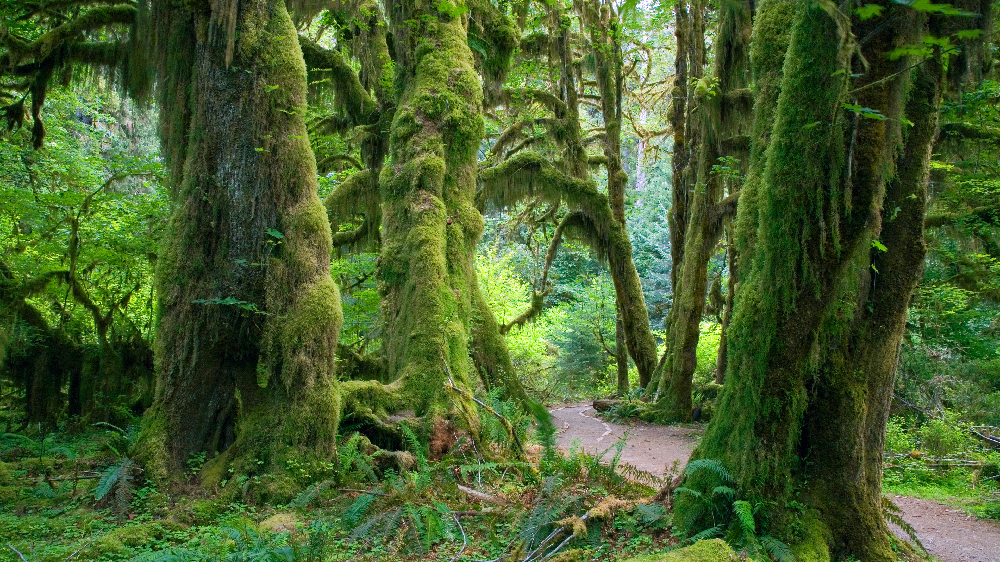

```json
{
  "images": [
    {
      "startdate": "20231123",
      "fullstartdate": "202311231600",
      "enddate": "20231124",
      "url": "/th?id=OHR.HallofMosses_ZH-CN1565129809_UHD.jpg&rf=LaDigue_UHD.jpg&pid=hp&w=3840&h=2160&rs=1&c=4",
      "urlbase": "/th?id=OHR.HallofMosses_ZH-CN1565129809",
      "copyright": "奥林匹克国家公园霍河雨林中的苔藓大厅 ，华盛顿州，美国 (© James Randklev/Getty Images)",
      "copyrightlink": "/search?q=%e9%9c%8d%e6%b2%b3%e9%9b%a8%e6%9e%97+%e5%a5%a5%e6%9e%97%e5%8c%b9%e5%85%8b%e5%9b%bd%e5%ae%b6%e5%85%ac%e5%9b%ad&form=hpcapt&mkt=zh-cn",
      "title": "不一样的热带雨林",
      "quiz": "/search?q=Bing+homepage+quiz&filters=WQOskey:%22HPQuiz_20231123_HallofMosses%22&FORM=HPQUIZ",
      "wp": true,
      "hsh": "622bf0811eea57072619fc2f63bcc4b6",
      "drk": 1,
      "top": 1,
      "bot": 1,
      "hs": []
    }
  ],
  "tooltips": {
    "loading": "正在加载...",
    "previous": "上一个图像",
    "next": "下一个图像",
    "walle": "此图片不能下载用作壁纸。",
    "walls": "下载今日美图。仅限用作桌面壁纸。"
  }
}
```
