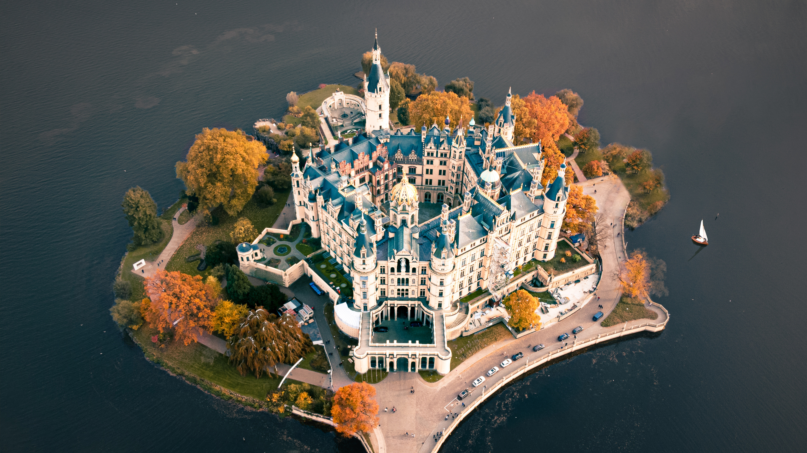

```json
{
  "images": [
    {
      "startdate": "20231128",
      "fullstartdate": "202311281600",
      "enddate": "20231129",
      "url": "/th?id=OHR.SchwerinerSchloss_ZH-CN2390476345_UHD.jpg&rf=LaDigue_UHD.jpg&pid=hp&w=3840&h=2160&rs=1&c=4",
      "urlbase": "/th?id=OHR.SchwerinerSchloss_ZH-CN2390476345",
      "copyright": "什未林湖上的什未林城堡，梅克伦堡-前波美拉尼亚州，德国 (© Hannes Wendt/Shutterstock)",
      "copyrightlink": "/search?q=%e4%bb%80%e6%9c%aa%e6%9e%97%e5%9f%8e%e5%a0%a1&form=hpcapt&mkt=zh-cn",
      "title": "童话中的城堡",
      "quiz": "/search?q=Bing+homepage+quiz&filters=WQOskey:%22HPQuiz_20231128_SchwerinerSchloss%22&FORM=HPQUIZ",
      "wp": true,
      "hsh": "20c6c7ba46073d01697152750e1a35d1",
      "drk": 1,
      "top": 1,
      "bot": 1,
      "hs": []
    }
  ],
  "tooltips": {
    "loading": "正在加载...",
    "previous": "上一个图像",
    "next": "下一个图像",
    "walle": "此图片不能下载用作壁纸。",
    "walls": "下载今日美图。仅限用作桌面壁纸。"
  }
}
```
