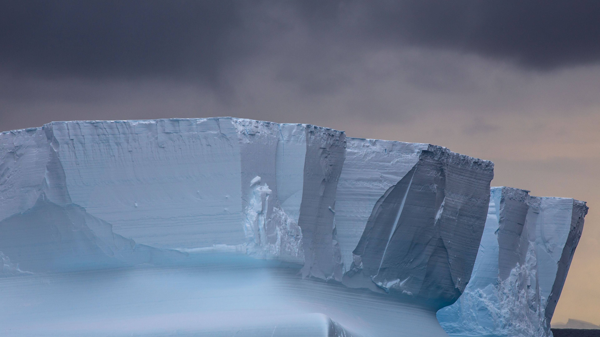

```json
{
  "images": [
    {
      "startdate": "20231130",
      "fullstartdate": "202311301600",
      "enddate": "20231201",
      "url": "/th?id=OHR.IcebergAntarctica_ZH-CN2053356825_UHD.jpg&rf=LaDigue_UHD.jpg&pid=hp&w=3840&h=2160&rs=1&c=4",
      "urlbase": "/th?id=OHR.IcebergAntarctica_ZH-CN2053356825",
      "copyright": "罗斯海的冰山，南极洲 (© Michel Roggo/Minden Pictures)",
      "copyrightlink": "/search?q=%e7%bd%97%e6%96%af%e6%b5%b7&form=hpcapt&mkt=zh-cn",
      "title": "为最酷的地方欢呼！",
      "quiz": "/search?q=Bing+homepage+quiz&filters=WQOskey:%22HPQuiz_20231130_IcebergAntarctica%22&FORM=HPQUIZ",
      "wp": true,
      "hsh": "39efaae73f87a07a2b2f11e2bd0815ca",
      "drk": 1,
      "top": 1,
      "bot": 1,
      "hs": []
    }
  ],
  "tooltips": {
    "loading": "正在加载...",
    "previous": "上一个图像",
    "next": "下一个图像",
    "walle": "此图片不能下载用作壁纸。",
    "walls": "下载今日美图。仅限用作桌面壁纸。"
  }
}
```
