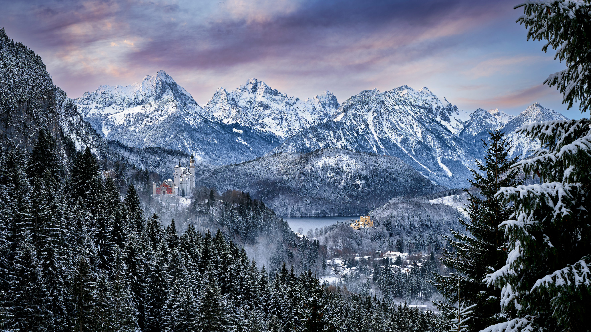

```json
{
  "images": [
    {
      "startdate": "20231204",
      "fullstartdate": "202312041600",
      "enddate": "20231205",
      "url": "/th?id=OHR.AlpsCastles_ZH-CN5078013932_UHD.jpg&rf=LaDigue_UHD.jpg&pid=hp&w=3840&h=2160&rs=1&c=4",
      "urlbase": "/th?id=OHR.AlpsCastles_ZH-CN5078013932",
      "copyright": "天鹅堡和旧天鹅堡，巴伐利亚阿尔卑斯山，德国 (© Harald Nachtmann/Getty Images)",
      "copyrightlink": "/search?q=%e6%96%b0%e5%a4%a9%e9%b9%85%e5%a0%a1%e5%92%8c%e6%97%a7%e5%a4%a9%e9%b9%85%e5%a0%a1&form=hpcapt&mkt=zh-cn",
      "title": "童话故事中的场景",
      "quiz": "/search?q=Bing+homepage+quiz&filters=WQOskey:%22HPQuiz_20231204_AlpsCastles%22&FORM=HPQUIZ",
      "wp": true,
      "hsh": "5ff82c65c3682ee0d86216aadc5590cc",
      "drk": 1,
      "top": 1,
      "bot": 1,
      "hs": []
    }
  ],
  "tooltips": {
    "loading": "正在加载...",
    "previous": "上一个图像",
    "next": "下一个图像",
    "walle": "此图片不能下载用作壁纸。",
    "walls": "下载今日美图。仅限用作桌面壁纸。"
  }
}
```
