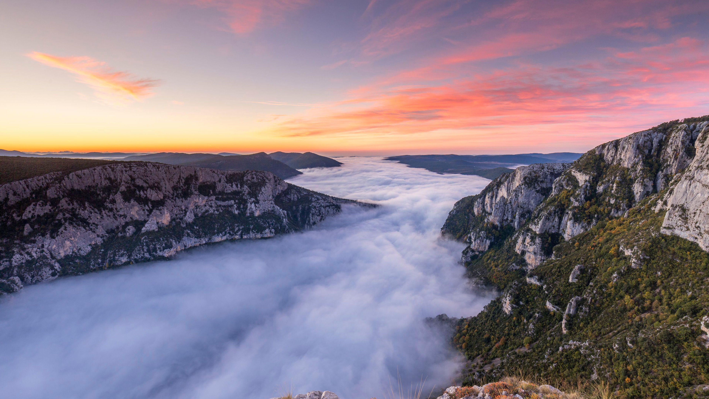

```json
{
  "images": [
    {
      "startdate": "20231206",
      "fullstartdate": "202312061600",
      "enddate": "20231207",
      "url": "/th?id=OHR.GrandCanyonVerdon_ZH-CN6025902720_UHD.jpg&rf=LaDigue_UHD.jpg&pid=hp&w=3840&h=2160&rs=1&c=4",
      "urlbase": "/th?id=OHR.GrandCanyonVerdon_ZH-CN6025902720",
      "copyright": "韦尔东峡谷的雾蒙蒙的早晨，普罗旺斯-阿尔卑斯-蓝色海岸大区，法国 (© Hemis/Alamy)",
      "copyrightlink": "/search?q=%e9%9f%a6%e5%b0%94%e4%b8%9c%e5%b3%a1%e8%b0%b7&form=hpcapt&mkt=zh-cn",
      "title": "欧洲大峡谷",
      "quiz": "/search?q=Bing+homepage+quiz&filters=WQOskey:%22HPQuiz_20231206_GrandCanyonVerdon%22&FORM=HPQUIZ",
      "wp": true,
      "hsh": "9b94ac21899b6963de9bb607acadc1f3",
      "drk": 1,
      "top": 1,
      "bot": 1,
      "hs": []
    }
  ],
  "tooltips": {
    "loading": "正在加载...",
    "previous": "上一个图像",
    "next": "下一个图像",
    "walle": "此图片不能下载用作壁纸。",
    "walls": "下载今日美图。仅限用作桌面壁纸。"
  }
}
```
