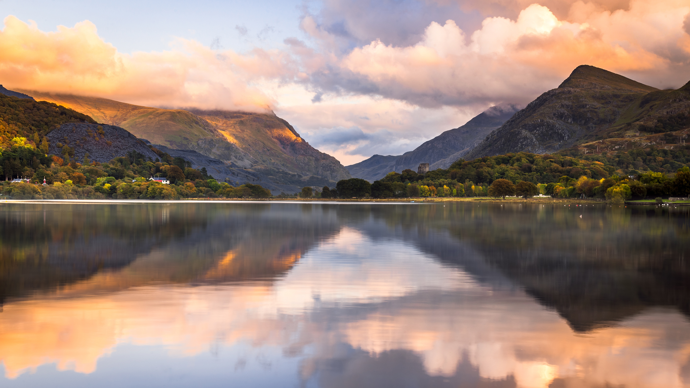

```json
{
  "images": [
    {
      "startdate": "20231209",
      "fullstartdate": "202312091600",
      "enddate": "20231210",
      "url": "/th?id=OHR.LlanberisSnowdoniaSunset_ZH-CN6682238671_UHD.jpg&rf=LaDigue_UHD.jpg&pid=hp&w=3840&h=2160&rs=1&c=4",
      "urlbase": "/th?id=OHR.LlanberisSnowdoniaSunset_ZH-CN6682238671",
      "copyright": "林帕达恩湖，斯诺登尼亚国家公园， 威尔士 (© Joe Daniel Price/Getty Images)",
      "copyrightlink": "/search?q=%e6%96%af%e8%af%ba%e7%99%bb%e5%b0%bc%e4%ba%9a%e5%9b%bd%e5%ae%b6%e5%85%ac%e5%9b%ad&form=hpcapt&mkt=zh-cn",
      "title": "一个让人沉思的地方",
      "quiz": "/search?q=Bing+homepage+quiz&filters=WQOskey:%22HPQuiz_20231209_LlanberisSnowdoniaSunset%22&FORM=HPQUIZ",
      "wp": true,
      "hsh": "ec0260ad9ec00acee0b421ed07133a5a",
      "drk": 1,
      "top": 1,
      "bot": 1,
      "hs": []
    }
  ],
  "tooltips": {
    "loading": "正在加载...",
    "previous": "上一个图像",
    "next": "下一个图像",
    "walle": "此图片不能下载用作壁纸。",
    "walls": "下载今日美图。仅限用作桌面壁纸。"
  }
}
```
