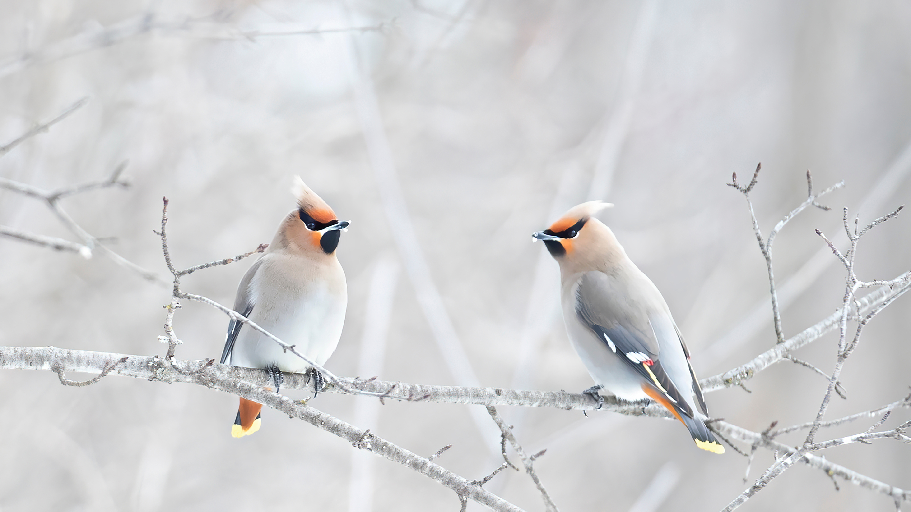

```json
{
  "images": [
    {
      "startdate": "20231216",
      "fullstartdate": "202312161600",
      "enddate": "20231217",
      "url": "/th?id=OHR.WinterWaxwings_ZH-CN9274297835_UHD.jpg&rf=LaDigue_UHD.jpg&pid=hp&w=3840&h=2160&rs=1&c=4",
      "urlbase": "/th?id=OHR.WinterWaxwings_ZH-CN9274297835",
      "copyright": "波西米亚太平鸟栖息在树枝上，加拿大 (© Jim Cumming/Shutterstock)",
      "copyrightlink": "/search?q=%e6%b3%a2%e8%a5%bf%e7%b1%b3%e4%ba%9a%e5%a4%aa%e5%b9%b3%e9%b8%9f&form=hpcapt&mkt=zh-cn",
      "title": "有羽毛的时尚达人",
      "quiz": "/search?q=Bing+homepage+quiz&filters=WQOskey:%22HPQuiz_20231216_WinterWaxwings%22&FORM=HPQUIZ",
      "wp": true,
      "hsh": "209b71f36dc0be688586a997c60ebe63",
      "drk": 1,
      "top": 1,
      "bot": 1,
      "hs": []
    }
  ],
  "tooltips": {
    "loading": "正在加载...",
    "previous": "上一个图像",
    "next": "下一个图像",
    "walle": "此图片不能下载用作壁纸。",
    "walls": "下载今日美图。仅限用作桌面壁纸。"
  }
}
```
