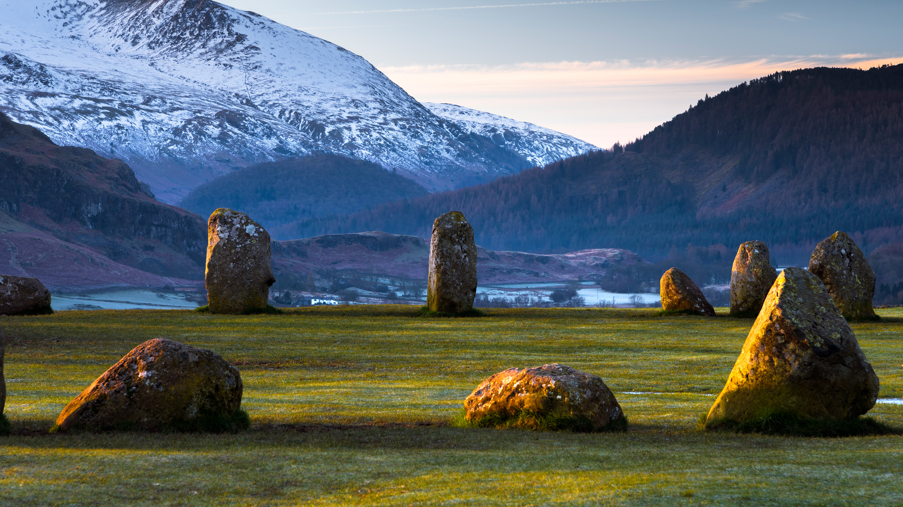

```json
{
  "images": [
    {
      "startdate": "20231229",
      "fullstartdate": "202312291600",
      "enddate": "20231230",
      "url": "/th?id=OHR.CastleriggStoneCircleUK_ZH-CN1174541384_UHD.jpg&rf=LaDigue_UHD.jpg&pid=hp&w=3840&h=2160&rs=1&c=4",
      "urlbase": "/th?id=OHR.CastleriggStoneCircleUK_ZH-CN1174541384",
      "copyright": "卡塞里格石圈，湖区国家公园 ，坎布里亚，英国 (© John Finney Photography/Getty Images)",
      "copyrightlink": "/search?q=%e5%8d%a1%e5%a1%9e%e9%87%8c%e6%a0%bc%e7%9f%b3%e5%9c%88&form=hpcapt&mkt=zh-cn",
      "title": "古石圈",
      "quiz": "/search?q=Bing+homepage+quiz&filters=WQOskey:%22HPQuiz_20231229_CastleriggStoneCircleUK%22&FORM=HPQUIZ",
      "wp": true,
      "hsh": "22851ac6fd9e60127e03076f6f529872",
      "drk": 1,
      "top": 1,
      "bot": 1,
      "hs": []
    }
  ],
  "tooltips": {
    "loading": "正在加载...",
    "previous": "上一个图像",
    "next": "下一个图像",
    "walle": "此图片不能下载用作壁纸。",
    "walls": "下载今日美图。仅限用作桌面壁纸。"
  }
}
```
