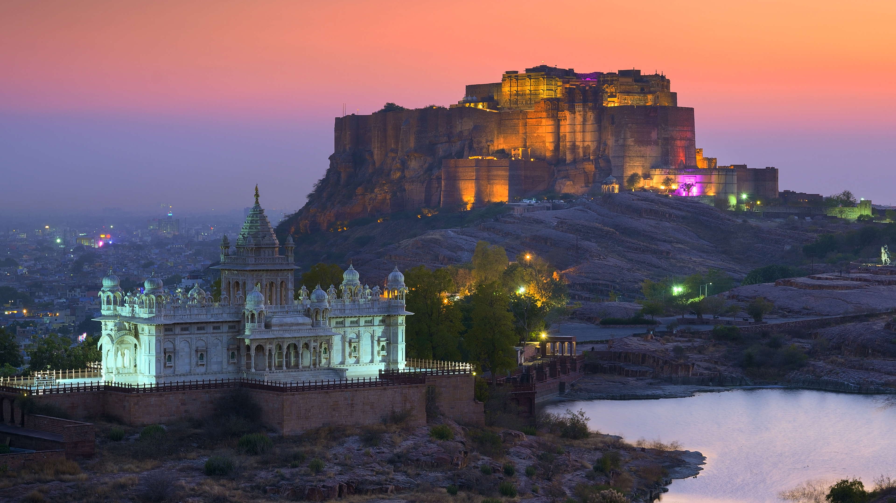

```json
{
  "images": [
    {
      "startdate": "20240101",
      "fullstartdate": "202401011600",
      "enddate": "20240102",
      "url": "/th?id=OHR.MehrangarhJodhpur_ZH-CN2855490711_UHD.jpg&rf=LaDigue_UHD.jpg&pid=hp&w=3840&h=2160&rs=1&c=4",
      "urlbase": "/th?id=OHR.MehrangarhJodhpur_ZH-CN2855490711",
      "copyright": "贾斯旺萨达陵墓和梅兰加尔古堡，焦特布尔，拉贾斯坦邦，印度 (© Twenty47studio/Getty images)",
      "copyrightlink": "/search?q=%e6%a2%85%e5%85%b0%e5%8a%a0%e5%b0%94%e5%8f%a4%e5%a0%a1&form=hpcapt&mkt=zh-cn",
      "title": "百年城堡",
      "quiz": "/search?q=Bing+homepage+quiz&filters=WQOskey:%22HPQuiz_20240101_MehrangarhJodhpur%22&FORM=HPQUIZ",
      "wp": true,
      "hsh": "eddbaa01109ee2233bde7843b0b76cbc",
      "drk": 1,
      "top": 1,
      "bot": 1,
      "hs": []
    }
  ],
  "tooltips": {
    "loading": "正在加载...",
    "previous": "上一个图像",
    "next": "下一个图像",
    "walle": "此图片不能下载用作壁纸。",
    "walls": "下载今日美图。仅限用作桌面壁纸。"
  }
}
```
