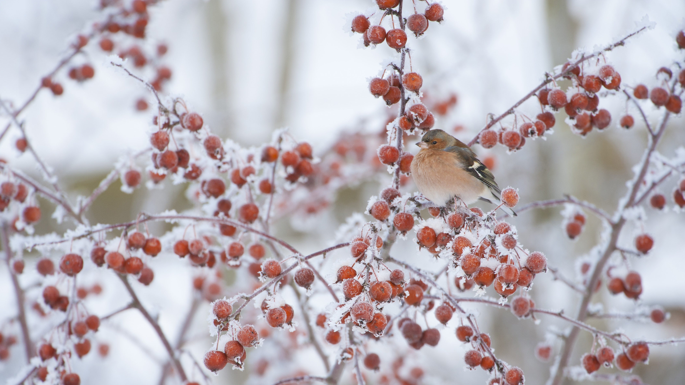

```json
{
  "images": [
    {
      "startdate": "20240105",
      "fullstartdate": "202401051600",
      "enddate": "20240106",
      "url": "/th?id=OHR.CrabappleChaffinch_ZH-CN4458529756_UHD.jpg&rf=LaDigue_UHD.jpg&pid=hp&w=3840&h=2160&rs=1&c=4",
      "urlbase": "/th?id=OHR.CrabappleChaffinch_ZH-CN4458529756",
      "copyright": "冬天，雄性苍头燕雀栖息在海棠果树上 (© Mark Hamblin/2020VISION/Minden Pictures)",
      "copyrightlink": "/search?q=%e6%b5%b7%e6%a3%a0%e6%9e%9c&form=hpcapt&mkt=zh-cn",
      "title": "薅一个苹果！",
      "quiz": "/search?q=Bing+homepage+quiz&filters=WQOskey:%22HPQuiz_20240105_CrabappleChaffinch%22&FORM=HPQUIZ",
      "wp": true,
      "hsh": "93969b855f535691d27b516068f79512",
      "drk": 1,
      "top": 1,
      "bot": 1,
      "hs": []
    }
  ],
  "tooltips": {
    "loading": "正在加载...",
    "previous": "上一个图像",
    "next": "下一个图像",
    "walle": "此图片不能下载用作壁纸。",
    "walls": "下载今日美图。仅限用作桌面壁纸。"
  }
}
```
