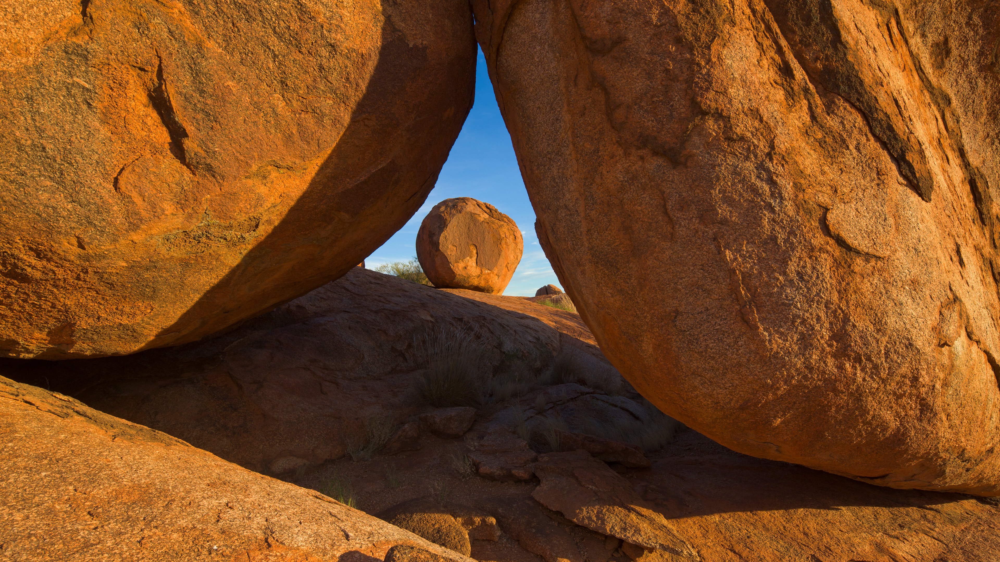

```json
{
  "images": [
    {
      "startdate": "20240106",
      "fullstartdate": "202401061600",
      "enddate": "20240107",
      "url": "/th?id=OHR.DevilsMarbles_ZH-CN4897809914_UHD.jpg&rf=LaDigue_UHD.jpg&pid=hp&w=3840&h=2160&rs=1&c=4",
      "urlbase": "/th?id=OHR.DevilsMarbles_ZH-CN4897809914",
      "copyright": "魔鬼大理石保护区，澳大利亚 (© Yva Momatiuk and John Eastcott/Minden Pictures)",
      "copyrightlink": "/search?q=%e9%ad%94%e9%ac%bc%e5%a4%a7%e7%90%86%e7%9f%b3%e4%bf%9d%e6%8a%a4%e5%8c%ba&form=hpcapt&mkt=zh-cn",
      "title": "大自然的平衡术",
      "quiz": "/search?q=Bing+homepage+quiz&filters=WQOskey:%22HPQuiz_20240106_DevilsMarbles%22&FORM=HPQUIZ",
      "wp": true,
      "hsh": "5786d04ade3b164e45783246cd03ff48",
      "drk": 1,
      "top": 1,
      "bot": 1,
      "hs": []
    }
  ],
  "tooltips": {
    "loading": "正在加载...",
    "previous": "上一个图像",
    "next": "下一个图像",
    "walle": "此图片不能下载用作壁纸。",
    "walls": "下载今日美图。仅限用作桌面壁纸。"
  }
}
```
