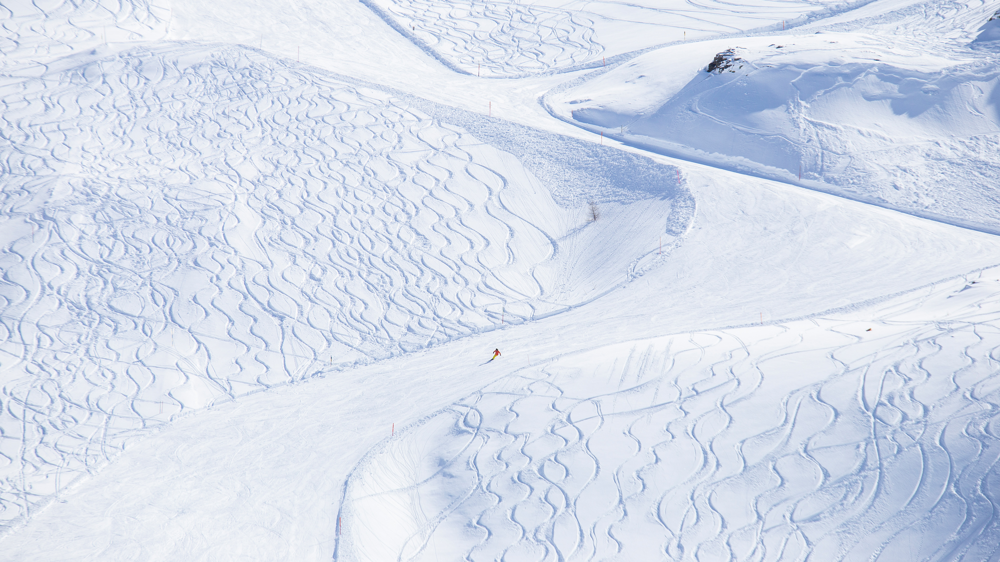

```json
{
  "images": [
    {
      "startdate": "20240107",
      "fullstartdate": "202401071600",
      "enddate": "20240108",
      "url": "/th?id=OHR.BerninaPass_ZH-CN5776010452_UHD.jpg&rf=LaDigue_UHD.jpg&pid=hp&w=3840&h=2160&rs=1&c=4",
      "urlbase": "/th?id=OHR.BerninaPass_ZH-CN5776010452",
      "copyright": "贝尔尼纳山口的滑雪场，格劳宾登州，瑞士 (© Francesco Bergamaschi/Getty Images)",
      "copyrightlink": "/search?q=%e8%b4%9d%e5%b0%94%e5%b0%bc%e7%ba%b3%e5%b1%b1&form=hpcapt&mkt=zh-cn",
      "title": "瑞士的雪花漱漱落下",
      "quiz": "/search?q=Bing+homepage+quiz&filters=WQOskey:%22HPQuiz_20240107_BerninaPass%22&FORM=HPQUIZ",
      "wp": true,
      "hsh": "1393f137aad773aadfca4533442b0b2e",
      "drk": 1,
      "top": 1,
      "bot": 1,
      "hs": []
    }
  ],
  "tooltips": {
    "loading": "正在加载...",
    "previous": "上一个图像",
    "next": "下一个图像",
    "walle": "此图片不能下载用作壁纸。",
    "walls": "下载今日美图。仅限用作桌面壁纸。"
  }
}
```
