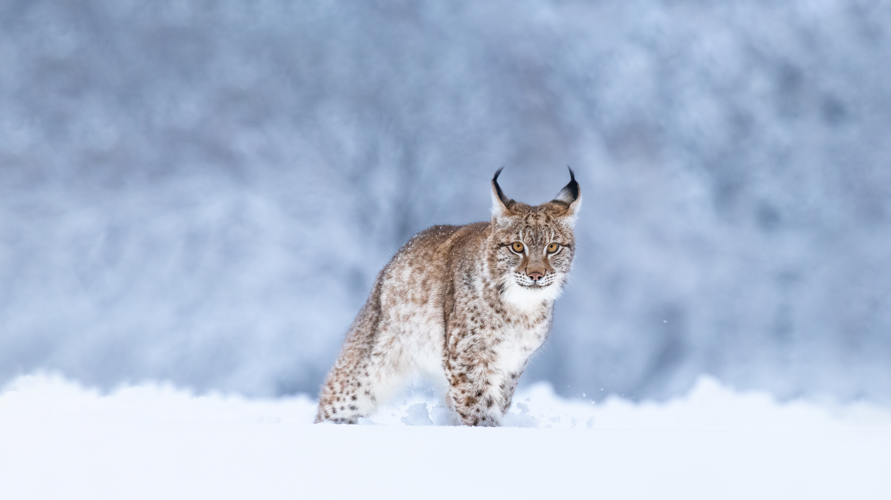

```json
{
  "images": [
    {
      "startdate": "20240110",
      "fullstartdate": "202401101600",
      "enddate": "20240111",
      "url": "/th?id=OHR.LynxSnow_ZH-CN8908082275_UHD.jpg&rf=LaDigue_UHD.jpg&pid=hp&w=3840&h=2160&rs=1&c=4",
      "urlbase": "/th?id=OHR.LynxSnow_ZH-CN8908082275",
      "copyright": "雪中的欧亚猞猁 (© Jan Stria/Shutterstock)",
      "copyrightlink": "/search?q=%e6%ac%a7%e4%ba%9a%e7%8c%9e%e7%8c%81&form=hpcapt&mkt=zh-cn",
      "title": "长胡须的“流浪汉”",
      "quiz": "/search?q=Bing+homepage+quiz&filters=WQOskey:%22HPQuiz_20240110_LynxSnow%22&FORM=HPQUIZ",
      "wp": true,
      "hsh": "1d04586a99799a30c05ae94b095d2d15",
      "drk": 1,
      "top": 1,
      "bot": 1,
      "hs": []
    }
  ],
  "tooltips": {
    "loading": "正在加载...",
    "previous": "上一个图像",
    "next": "下一个图像",
    "walle": "此图片不能下载用作壁纸。",
    "walls": "下载今日美图。仅限用作桌面壁纸。"
  }
}
```
