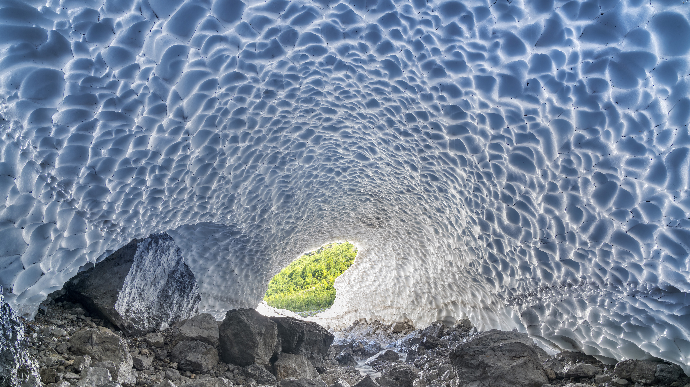

```json
{
  "images": [
    {
      "startdate": "20240114",
      "fullstartdate": "202401141600",
      "enddate": "20240115",
      "url": "/th?id=OHR.IceChapel_ZH-CN9189733666_UHD.jpg&rf=LaDigue_UHD.jpg&pid=hp&w=3840&h=2160&rs=1&c=4",
      "urlbase": "/th?id=OHR.IceChapel_ZH-CN9189733666",
      "copyright": "瓦茨曼山脚下的冰教堂，巴伐利亚，德国 (© Christian Bäck/eStock Photo)",
      "copyrightlink": "/search?q=%e7%93%a6%e8%8c%a8%e6%9b%bc%e5%b1%b1&form=hpcapt&mkt=zh-cn",
      "title": "在地球上还是在外星？",
      "quiz": "/search?q=Bing+homepage+quiz&filters=WQOskey:%22HPQuiz_20240114_IceChapel%22&FORM=HPQUIZ",
      "wp": true,
      "hsh": "b55e02a4c1b32c4e0ca1c342dd76d33a",
      "drk": 1,
      "top": 1,
      "bot": 1,
      "hs": []
    }
  ],
  "tooltips": {
    "loading": "正在加载...",
    "previous": "上一个图像",
    "next": "下一个图像",
    "walle": "此图片不能下载用作壁纸。",
    "walls": "下载今日美图。仅限用作桌面壁纸。"
  }
}
```
