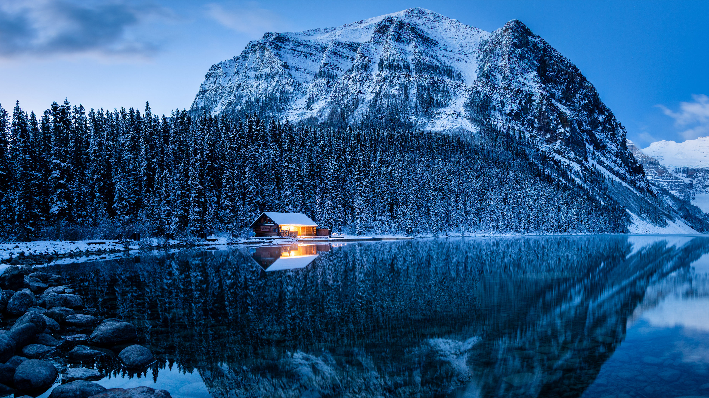

```json
{
  "images": [
    {
      "startdate": "20240115",
      "fullstartdate": "202401151600",
      "enddate": "20240116",
      "url": "/th?id=OHR.LakeLouise_ZH-CN9592539152_UHD.jpg&rf=LaDigue_UHD.jpg&pid=hp&w=3840&h=2160&rs=1&c=4",
      "urlbase": "/th?id=OHR.LakeLouise_ZH-CN9592539152",
      "copyright": "路易斯湖，班夫国家公园，阿尔伯塔省，加拿大 (© Mr. Simon Paul/Shutterstock)",
      "copyrightlink": "/search?q=%e7%8f%ad%e5%a4%ab%e5%9b%bd%e5%ae%b6%e5%85%ac%e5%9b%ad%e8%b7%af%e6%98%93%e6%96%af%e6%b9%96&form=hpcapt&mkt=zh-cn",
      "title": "加拿大式的小憩和放松",
      "quiz": "/search?q=Bing+homepage+quiz&filters=WQOskey:%22HPQuiz_20240115_LakeLouise%22&FORM=HPQUIZ",
      "wp": true,
      "hsh": "33ec1fc08b7cceec563cf3e21307b46b",
      "drk": 1,
      "top": 1,
      "bot": 1,
      "hs": []
    }
  ],
  "tooltips": {
    "loading": "正在加载...",
    "previous": "上一个图像",
    "next": "下一个图像",
    "walle": "此图片不能下载用作壁纸。",
    "walls": "下载今日美图。仅限用作桌面壁纸。"
  }
}
```
