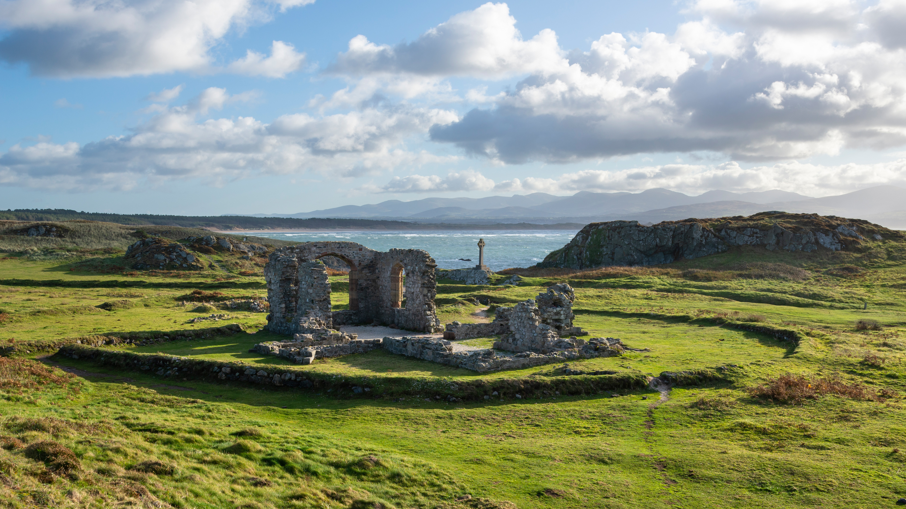

```json
{
  "images": [
    {
      "startdate": "20240124",
      "fullstartdate": "202401241600",
      "enddate": "20240125",
      "url": "/th?id=OHR.DwynwensDay_ZH-CN1768649253_UHD.jpg&rf=LaDigue_UHD.jpg&pid=hp&w=3840&h=2160&rs=1&c=4",
      "urlbase": "/th?id=OHR.DwynwensDay_ZH-CN1768649253",
      "copyright": "圣德温教堂的废墟，莫纳岛，威尔士，英国 (© Photos by R A Kearton/Getty Images)",
      "copyrightlink": "/search?q=%e8%8e%ab%e7%ba%b3%e5%b2%9b&form=hpcapt&mkt=zh-cn",
      "title": "通往过去的入口",
      "quiz": "/search?q=Bing+homepage+quiz&filters=WQOskey:%22HPQuiz_20240124_DwynwensDay%22&FORM=HPQUIZ",
      "wp": true,
      "hsh": "151dbd96f020e9d70233d81b38d42193",
      "drk": 1,
      "top": 1,
      "bot": 1,
      "hs": []
    }
  ],
  "tooltips": {
    "loading": "正在加载...",
    "previous": "上一个图像",
    "next": "下一个图像",
    "walle": "此图片不能下载用作壁纸。",
    "walls": "下载今日美图。仅限用作桌面壁纸。"
  }
}
```
