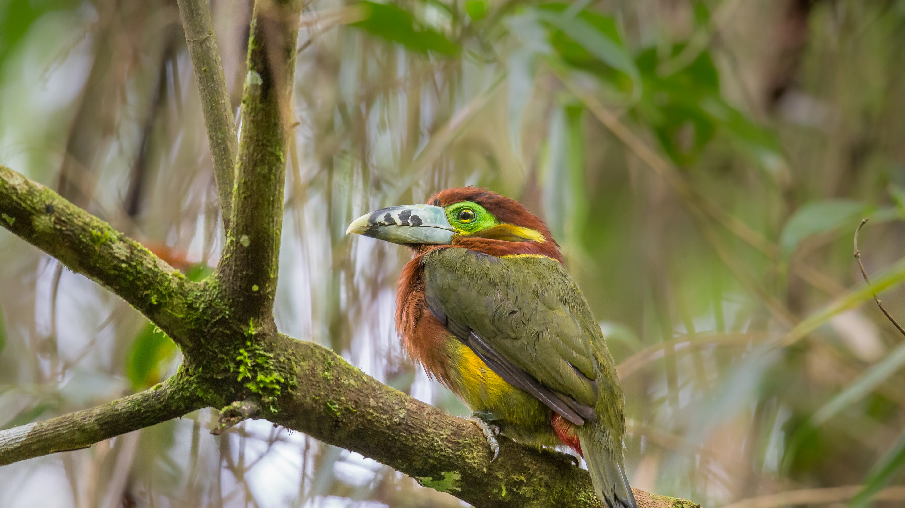

```json
{
  "images": [
    {
      "startdate": "20240126",
      "fullstartdate": "202401261600",
      "enddate": "20240127",
      "url": "/th?id=OHR.ToucanetEmpoleirado_ZH-CN8520861326_UHD.jpg&rf=LaDigue_UHD.jpg&pid=hp&w=3840&h=2160&rs=1&c=4",
      "urlbase": "/th?id=OHR.ToucanetEmpoleirado_ZH-CN8520861326",
      "copyright": "点嘴小巨嘴鸟，大西洋森林，巴西 (© aaprophoto/Getty Images)",
      "copyrightlink": "/search?q=%e7%82%b9%e5%98%b4%e5%b0%8f%e5%b7%a8%e5%98%b4%e9%b8%9f&form=hpcapt&mkt=zh-cn",
      "title": "巴西大自然中的异域之美",
      "quiz": "/search?q=Bing+homepage+quiz&filters=WQOskey:%22HPQuiz_20240126_ToucanetEmpoleirado%22&FORM=HPQUIZ",
      "wp": true,
      "hsh": "d850d3421877b5b4dba0a8b1258ed3f7",
      "drk": 1,
      "top": 1,
      "bot": 1,
      "hs": []
    }
  ],
  "tooltips": {
    "loading": "正在加载...",
    "previous": "上一个图像",
    "next": "下一个图像",
    "walle": "此图片不能下载用作壁纸。",
    "walls": "下载今日美图。仅限用作桌面壁纸。"
  }
}
```
