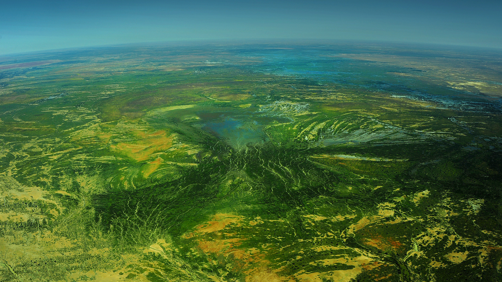

```json
{
  "images": [
    {
      "startdate": "20240127",
      "fullstartdate": "202401271600",
      "enddate": "20240128",
      "url": "/th?id=OHR.ChannelOutback_ZH-CN0579687777_UHD.jpg&rf=LaDigue_UHD.jpg&pid=hp&w=3840&h=2160&rs=1&c=4",
      "urlbase": "/th?id=OHR.ChannelOutback_ZH-CN0579687777",
      "copyright": "昆士兰州内陆海峡地区，澳大利亚 (© Southern Lightscapes-Australia/Getty Images)",
      "copyrightlink": "/search?q=%e6%98%86%e5%a3%ab%e5%85%b0%e5%b7%9e&form=hpcapt&mkt=zh-cn",
      "title": "从干涸的沙漠变成田园",
      "quiz": "/search?q=Bing+homepage+quiz&filters=WQOskey:%22HPQuiz_20240127_ChannelOutback%22&FORM=HPQUIZ",
      "wp": true,
      "hsh": "29526da22e3cdbe14c5f89b8c430a60f",
      "drk": 1,
      "top": 1,
      "bot": 1,
      "hs": []
    }
  ],
  "tooltips": {
    "loading": "正在加载...",
    "previous": "上一个图像",
    "next": "下一个图像",
    "walle": "此图片不能下载用作壁纸。",
    "walls": "下载今日美图。仅限用作桌面壁纸。"
  }
}
```
