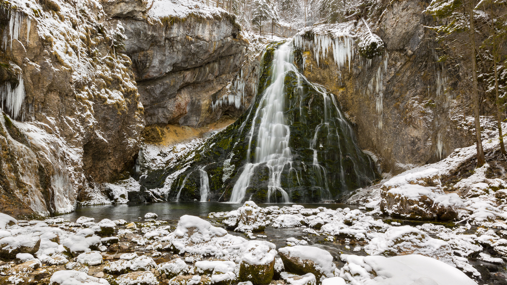

```json
{
  "images": [
    {
      "startdate": "20240128",
      "fullstartdate": "202401281600",
      "enddate": "20240129",
      "url": "/th?id=OHR.GollingerFalls_ZH-CN1137680822_UHD.jpg&rf=LaDigue_UHD.jpg&pid=hp&w=3840&h=2160&rs=1&c=4",
      "urlbase": "/th?id=OHR.GollingerFalls_ZH-CN1137680822",
      "copyright": "戈林格瀑布，泰嫩高，萨尔茨堡，奥地利 (© Frank Fischbach/Alamy Stock Photo)",
      "copyrightlink": "/search?q=+%e5%a5%a5%e5%9c%b0%e5%88%a9%e8%90%a8%e5%b0%94%e8%8c%a8%e5%a0%a1%e5%b7%9e&form=hpcapt&mkt=zh-cn",
      "title": "缓缓下降",
      "quiz": "/search?q=Bing+homepage+quiz&filters=WQOskey:%22HPQuiz_20240128_GollingerFalls%22&FORM=HPQUIZ",
      "wp": true,
      "hsh": "8b00e1a838343f834b62c0db5dbbd04c",
      "drk": 1,
      "top": 1,
      "bot": 1,
      "hs": []
    }
  ],
  "tooltips": {
    "loading": "正在加载...",
    "previous": "上一个图像",
    "next": "下一个图像",
    "walle": "此图片不能下载用作壁纸。",
    "walls": "下载今日美图。仅限用作桌面壁纸。"
  }
}
```
