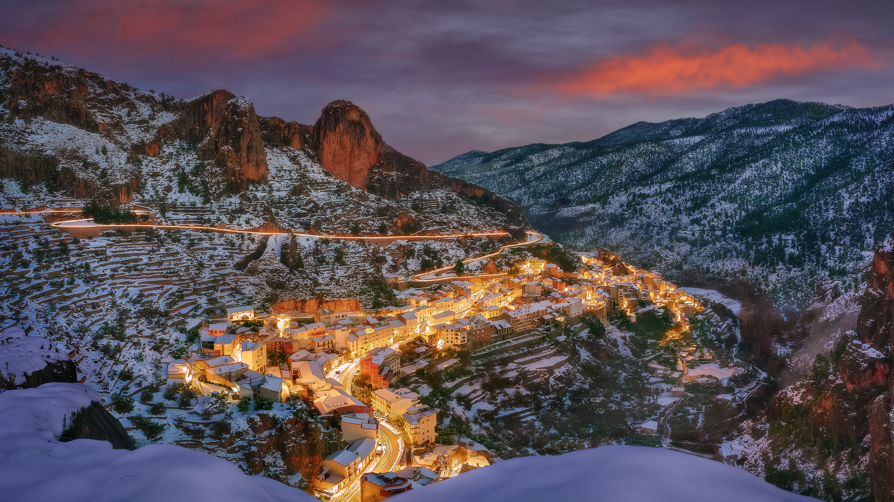

```json
{
  "images": [
    {
      "startdate": "20240129",
      "fullstartdate": "202401291600",
      "enddate": "20240130",
      "url": "/th?id=OHR.AlbaceteSpain_ZH-CN1597281896_UHD.jpg&rf=LaDigue_UHD.jpg&pid=hp&w=3840&h=2160&rs=1&c=4",
      "urlbase": "/th?id=OHR.AlbaceteSpain_ZH-CN1597281896",
      "copyright": "艾纳, 塞古拉山脉, 阿尔瓦塞特, 西班牙 (© Juan Maria Coy Vergara/Getty Images)",
      "copyrightlink": "/search?q=%e8%a5%bf%e7%8f%ad%e7%89%99%e9%98%bf%e5%b0%94%e7%93%a6%e5%a1%9e%e7%89%b9%e8%89%be%e7%ba%b3&form=hpcapt&mkt=zh-cn",
      "title": "西班牙的小瑞士",
      "quiz": "/search?q=Bing+homepage+quiz&filters=WQOskey:%22HPQuiz_20240129_AlbaceteSpain%22&FORM=HPQUIZ",
      "wp": true,
      "hsh": "20e7bd36e72299450ac68547b6b7971a",
      "drk": 1,
      "top": 1,
      "bot": 1,
      "hs": []
    }
  ],
  "tooltips": {
    "loading": "正在加载...",
    "previous": "上一个图像",
    "next": "下一个图像",
    "walle": "此图片不能下载用作壁纸。",
    "walls": "下载今日美图。仅限用作桌面壁纸。"
  }
}
```
